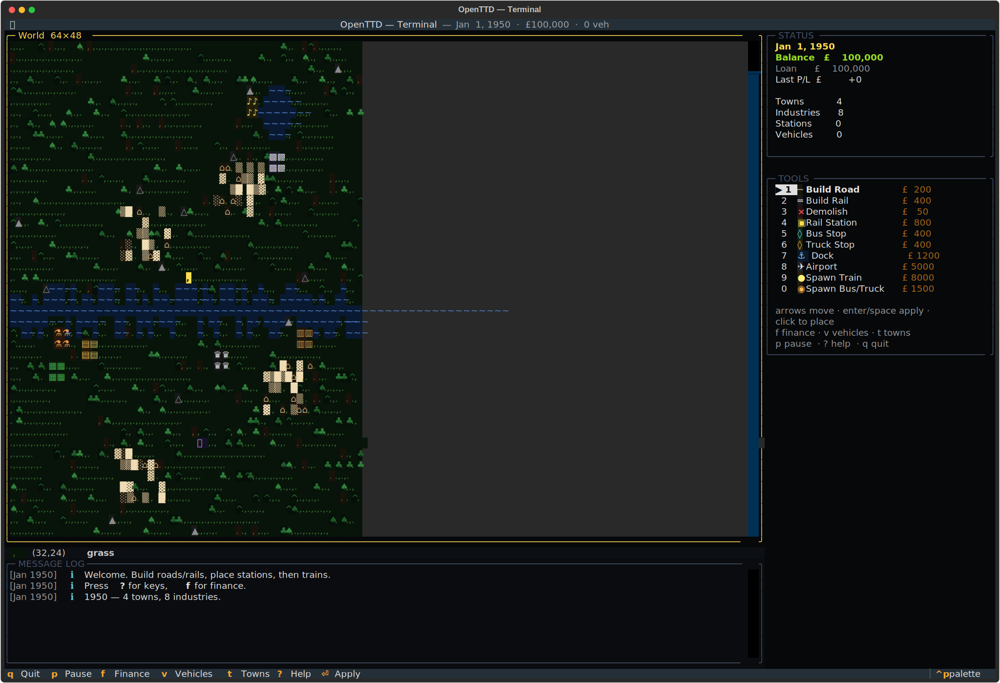
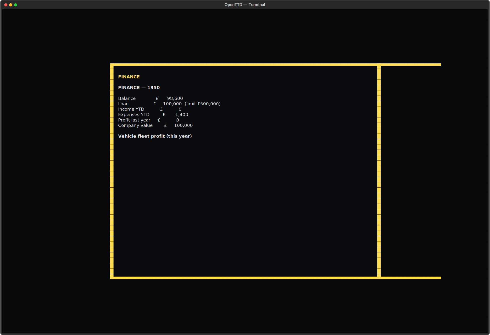
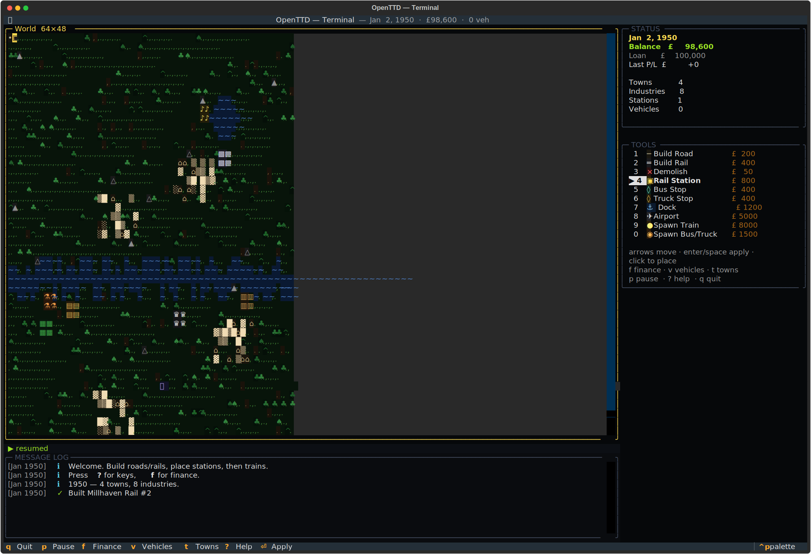

# openttd-tui
Keep the trains running.





## About
Stations. Trucks. Tracks. Trains. The purest rush in management gaming, now in the shell. Lay road, lay rail, place stations, route vehicles, tick the economy, watch the finance panel swing from red to black. Mouse or keyboard. REST-controllable for agents who like to hoard branch lines. Transport Tycoon has not aged a day.

## Screenshots


## Install & Run
```bash
git clone https://github.com/akakabrian/openttd-tui
cd openttd-tui
make
make run
```

## Controls
<Add controls info from code or existing README>

## Testing
```bash
make test       # QA harness
make playtest   # scripted critical-path run
make perf       # performance baseline
```

## License
MIT

## Built with
- [Textual](https://textual.textualize.io/) — the TUI framework
- [tui-game-build](https://github.com/akakabrian/tui-foundry) — shared build process
